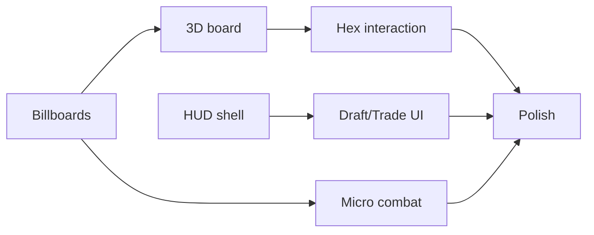

# Implementation Plan — 3D UI (Run I — I12)

Future implementation runs **after** Run H merge and Run I doc approval. Not executed in Run I.

---

## Impl I1 — Shared HUD shell

- `HudShellViewModel` aggregating turn, VP, resources, events
- Wire into `strategic_play_2d_mode` first, then 3D modes
- Tests: read-only boundary, field parity

---

## Impl I2 — 3D board presentation

- Replace procedural boxes with hex meshes + biome tints
- Integrate camera orbit controller
- Event VFX hooks from event log

---

## Impl I3 — Wizard embodiment + hex interaction

- Ray pick → legal action mapping
- M22 hex click-to-build for cities/roads/developments
- Hero move pick two-click flow

---

## Impl I4 — Draft & trade UI

- Card grid draft panel
- Trade offer builder + inbox ([DRAFTING_CARD_UI_PLAN.md](DRAFTING_CARD_UI_PLAN.md), [TRADE_UI_PLAN.md](TRADE_UI_PLAN.md))

---

## Impl I5 — Micro combat presentation

- Tactical arena scene with billboards + status icons
- Spell picker UI wired to `SpellCombatSession`

---

## Impl I6 — Billboard pipeline

- Create `godot_game/assets/billboards/` + manifest loader
- Replace placeholder meshes

---

## Impl I7 — Polish & product default

- Set wizard-world or unified shell as F5 default
- InputMap, audio stubs, performance pass
- Player-facing build profile vs dev profile

---

## Dependencies

