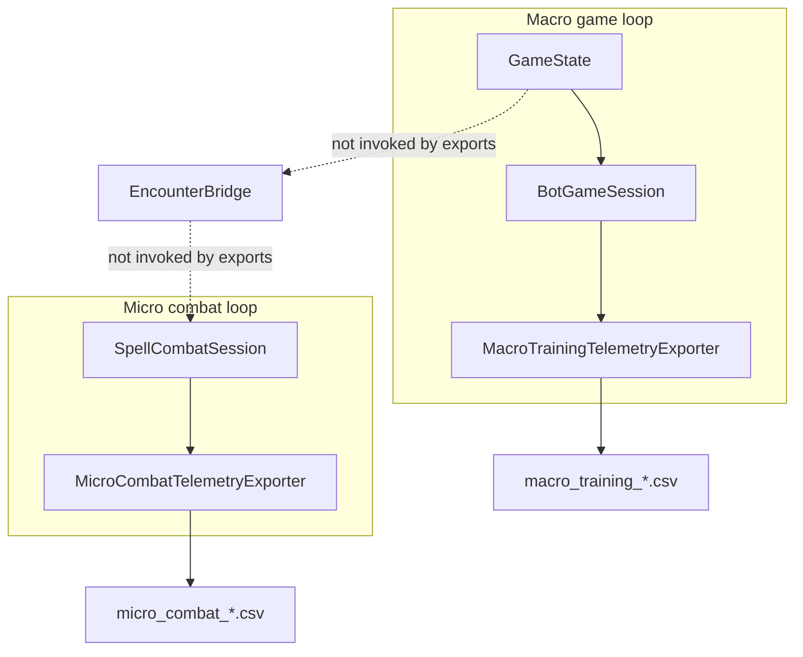
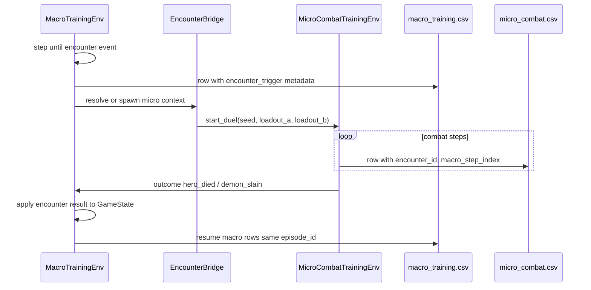

# Macro–Micro Integration Design

**Last updated:** 2026-06-12  
**Purpose:** Describe how the headless macro economic game and headless micro spell combat relate today, and how their **training datasets** should eventually connect. Run C documents current separation and target linkage without implementing coupling.

---

## Game architecture (reminder)

| Layer | Authority | Training export today |
|---|---|---|
| **Macro** | `GameState` via `BotGameSession` | `MacroTrainingTelemetryExporter` (`macro_training_v1`) |
| **Micro** | `SpellCombatSession` (1v1 spell duel) | `MicroCombatTelemetryExporter` (`micro_combat_v1`) |
| **Bridge** | `EncounterBridge` — hero vs demon on board | **Not wired** into either training export |
| **Embodied / UI** | Presentation only | Must not appear in training CSVs |

Same seed plus same legal actions must produce the same macro result. Micro combat is deterministic from seed and loadout pair. The two systems are **parallel**, not nested in the current export pipeline.

---

## Current state (2026-06)

**What works today**

- Macro export: 4-player bot steps with legal masks, actions, provisional rewards.
- Micro export: spell duel steps aligned with `spell_combat_replay_mode.gd` deterministic policy.
- `EncounterBridge.submit_hero_vs_demon()` resolves encounters on `GameState` (headless rules).

**What does not exist today**

- Macro step that launches micro combat and writes linked rows.
- Shared `encounter_id` across CSV files.
- Injection of micro outcome (hero death, demon banished) back into macro `GameState` from training export.
- Single unified training schema.

---

## Training dataset relationship — target architecture

Future integrated play should treat macro and micro as **hierarchical episodes**:

1. **Macro episode** — full civilization game from seed to terminal (VP win, breach loss, etc.).
2. **Encounter trigger** — macro event when hero and demon interact (node, hero ID, demon strength).
3. **Micro sub-episode** — spell combat seeded from encounter context (loadouts derived from hero/demon profiles).
4. **Outcome injection** — micro winner affects macro state (hero removed, demon cleared, resources, VP).

### Planned join keys (schema v2+)

| Field | Macro CSV | Micro CSV | Purpose |
|---|---|---|---|
| `episode_id` | Yes | Yes | Single macro game instance |
| `encounter_id` | On trigger row | All micro rows in sub-episode | Link sub-episode |
| `macro_step_index` | Yes | On micro rows | Which macro step spawned combat |
| `board_node_key` | On trigger | Optional | Where encounter occurred |
| `hero_id` / `demon_id` | On trigger | Maps to loadouts | Provenance |

Until these exist, **do not train one model on concatenated macro + micro CSVs**.

---

## What not to merge today

| Risk | Reason |
|---|---|
| Concatenated CSV rows | Different row grains (policy step vs spell step) |
| Shared action index | Macro: ~425 integer actions; micro: variable string spell IDs |
| Shared observation vector | Incompatible shapes and semantics |
| Same `seed` as sole key | Micro seed collides across loadout pairs; macro seed collides across policies |
| `DuelLogExporter` data | Card-duel model, not `SpellCombatSession` |

Training pipelines should consume **separate datasets** with separate models or a hierarchical trainer that respects encounter boundaries.

---

## Self-play and multi-agent notes

**Macro (4-player turn-based)**

- Export logs **active player POV only** per step.
- Opponent models need either multiple POV rows per macro turn (not exported) or centralized training with full `GameState` replay from seed.
- Self-play requires recording all players' decisions, not only the active bot.

**Micro (1v1 alternating turns)**

- Rows alternate `combatant_id` / `active_combatant_id` between combatants.
- Deterministic export uses same policy for both sides (first legal spell); true self-play needs separate policies per combatant and export of both policies' intents.

---

## EncounterBridge and loadout mapping (future)

Today micro export uses CLI loadouts (`hero_patrol`, `demon_breach`) from [`godot_game/data/spells/combatant_loadouts_v1.json`](../godot_game/data/spells/combatant_loadouts_v1.json).

Future integration should:

1. Map macro hero state → loadout ID (equipment, level, class).
2. Map macro demon context → demon loadout ID (breach tier, node corruption).
3. Derive micro **seed** from `(macro_seed, encounter_id)` for reproducibility.
4. Write micro rows with `encounter_id` and return structured outcome to macro rules.

`EncounterBridge` is the logical integration point; spell combat session is the micro authority — not `CombatResolver` card duels.

---

## Recommended integration milestones (not Run C)

1. **Encounter event in macro export** — structured `encounter_trigger` in events or dedicated columns.
2. **Linked micro export run mode** — `--encounter-id`, `--macro-step-index`, `--episode-id` from macro runner.
3. **Outcome application rules** — test-covered path from micro winner to macro `GameState` mutation.
4. **Unified manifest** — JSON sidecar listing macro file, micro file(s), join keys, provenance.
5. **Hierarchical RL design doc** — options-level macro policy + combat policy vs end-to-end with featurized bridge.

---

## Related docs

- [NEURAL_TRAINING_DATA_EXPORT_AUDIT.md](NEURAL_TRAINING_DATA_EXPORT_AUDIT.md) — per-export readiness
- [RULES_GAP_ANALYSIS_AND_DECISION_LOG.md](RULES_GAP_ANALYSIS_AND_DECISION_LOG.md) — NTD-006 decision
- [integration_plan.md](integration_plan.md) — donor merge and M8 bridge
- [GAME_DESIGN_BRIEF.md](GAME_DESIGN_BRIEF.md) — macro authoritative, wizard duels deferred in product loop
- [run_modes.md](run_modes.md) — current independent export commands
