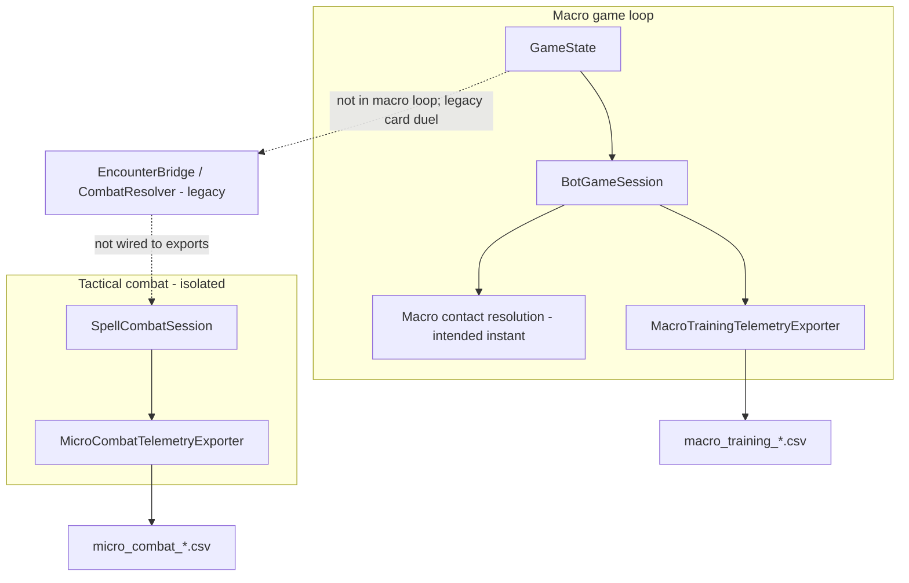

# Macro–Micro Integration Design

**Last updated:** 2026-06-12 (post–Run C design clarification)  
**Purpose:** Describe how the headless macro economic game and tactical spell combat relate today, and how their **training datasets** should eventually connect. **Do not integrate tactical combat into the macro loop yet.**

---

## Terminology

| Term | System | Role |
|---|---|---|
| **Macro game** | `GameState` / `BotGameSession` | Board economy, heroes, demons, VP, breach |
| **Macro contact resolution** | Instant deterministic rules on `GameState` | Hero enters demon node → all demons removed. **Not** spell combat. |
| **Tactical combat** | `SpellCombatSession` | Canonical spell duel for sim, replay, telemetry, future 3D encounters |
| **Legacy card duel** | `CombatResolver` / `EncounterRules` | Debug/reference; **not** intended macro resolution |
| **3D human encounter** | Future embodied layer | May pause game and lead to tactical combat; not in macro loop today |

---

## Design decision: keep macro and tactical combat separate

| Decision | Detail |
|---|---|
| Macro hero vs demon | **Instant macro contact resolution** — hero removes all demons on node |
| No SpellCombatSession in macro AI | Macro bots and rules must not invoke spell combat |
| Tactical combat timing | Only in isolated modes or future 3D human encounters |
| Training exports | Separate datasets until explicit encounter-bridge milestone |

---

## Game architecture (reminder)

| Layer | Authority | Training export today |
|---|---|---|
| **Macro** | `GameState` via `BotGameSession` | `MacroTrainingTelemetryExporter` (`macro_training_v1`) |
| **Tactical combat** | `SpellCombatSession` (1v1 spell duel) | `MicroCombatTelemetryExporter` (`micro_combat_v1`) |
| **Legacy bridge** | `EncounterBridge` / `EncounterRules` (card duel) | **Not** training source; not intended v1 macro behaviour |
| **Embodied / UI** | Presentation only | Must not appear in training CSVs |

Same seed plus same legal actions must produce the same macro result. Tactical combat is deterministic from seed and loadout pair. The two systems are **parallel**, not nested in the current export pipeline.

---

## Current state (2026-06)



**What works today**

- Macro export: bot steps with legal masks, actions, provisional rewards.
- Tactical export: spell duel steps aligned with `spell_combat_replay_mode.gd` deterministic policy.
- Macro loop: multi-step turns until `END_TURN`; hero move without instant demon clearance (gap vs design).

**What does not exist today**

- Instant macro contact resolution (hero removes all demons on enter).
- Macro step that launches `SpellCombatSession` from board state.
- Shared `encounter_id` across CSV files.
- Injection of tactical combat outcome back into macro `GameState` from training export.
- Single unified training schema.

**Legacy note:** `EncounterBridge.submit_hero_vs_demon()` and `EncounterRules.resolve_hero_vs_demon()` use the **card-duel** `CombatResolver` model. This is **not** the intended v1 macro rule and **not** the canonical tactical combat model (`SpellCombatSession`). Treat as legacy/debug unless explicitly revived.

---

## Future integration (deferred — not next milestone)

When 3D human encounters exist, integrated play **may** treat macro and tactical combat as hierarchical episodes:

1. **Macro episode** — full civilization game from seed to terminal.
2. **3D encounter trigger** — human wizard within encounter radius of city, hero, demon, or wizard; game pauses.
3. **Tactical sub-episode** — `SpellCombatSession` seeded from encounter context (loadouts derived from macro profiles).
4. **Outcome injection** — tactical winner affects macro state through rule functions only.

```mermaid
sequenceDiagram
  participant Macro as MacroTrainingEnv
  participant Encounter as 3D encounter layer
  participant Tactical as SpellCombatSession
  participant MacroCsv as macro_training.csv
  participant MicroCsv as micro_combat.csv

  Macro->>Macro: step until 3D encounter trigger
  Macro->>MacroCsv: row with encounter_trigger metadata
  Macro->>Encounter: pause; human chooses fight/avoid
  Encounter->>Tactical: start_duel if fight chosen
  loop tactical steps
    Tactical->>MicroCsv: row with encounter_id, macro_step_index
  end
  Tactical->>Macro: outcome via rule API
  Macro->>MacroCsv: resume macro rows same episode_id
```

**Until this is implemented:** macro AI uses **instant macro contact resolution**, not tactical combat.

### Planned join keys (schema v2+)

| Field | Macro CSV | Tactical CSV | Purpose |
|---|---|---|---|
| `episode_id` | Yes | Yes | Single macro game instance |
| `encounter_id` | On trigger row | All tactical rows in sub-episode | Link sub-episode |
| `macro_step_index` | Yes | On tactical rows | Which macro step spawned encounter |
| `board_node_key` | On trigger | Optional | Where encounter occurred |
| `hero_id` / demon context | On trigger | Maps to loadouts | Provenance |

Do **not** train one model on concatenated macro + tactical CSVs until join keys exist.

---

## What not to merge today

| Risk | Reason |
|---|---|
| Concatenated CSV rows | Different row grains (policy step vs spell step) |
| Shared action index | Macro: ~425 integer actions; tactical: variable string spell IDs |
| Shared observation vector | Incompatible shapes and semantics |
| Same `seed` as sole key | Tactical seed collides across loadout pairs; macro seed collides across policies |
| `DuelLogExporter` data | Card-duel model, not `SpellCombatSession` |
| Assuming macro uses spell combat | Design decision: macro = instant contact resolution |

Training pipelines should consume **separate datasets** with separate models or a hierarchical trainer that respects encounter boundaries.

---

## Self-play and multi-agent notes

**Macro (4-player turn-based)**

- Design target: **full global state** observation for macro RL (not hidden-information POV).
- Current export logs active player POV only per step — gap vs design.
- Self-play requires recording all players' decisions or replay from seed.

**Tactical combat (1v1 alternating turns)**

- Rows alternate `combatant_id` / `active_combatant_id` between combatants.
- Deterministic export uses same policy for both sides; true self-play needs separate policies per combatant.

---

## Loadout mapping (future, when 3D encounters exist)

Today tactical export uses CLI loadouts (`hero_patrol`, `demon_breach`) from [`godot_game/data/spells/combatant_loadouts_v1.json`](../godot_game/data/spells/combatant_loadouts_v1.json).

Future integration should:

1. Map macro hero/demon context → loadout ID.
2. Derive tactical **seed** from `(macro_seed, encounter_id)` for reproducibility.
3. Write tactical rows with `encounter_id` and return structured outcome through rule APIs.

`SpellCombatSession` is the tactical authority — not `CombatResolver` card duels.

---

## Recommended integration milestones (deferred)

1. **Macro contact resolution** — instant demon removal in rules engine (no spell combat).
2. **Encounter event in macro export** — structured `encounter_trigger` when 3D layer exists.
3. **Linked tactical export run mode** — `--encounter-id`, `--macro-step-index`, `--episode-id`.
4. **Outcome application rules** — test-covered path from tactical winner to `GameState` via rule functions.
5. **Unified manifest** — JSON sidecar with join keys and provenance.
6. **Hierarchical RL design** — options-level macro policy + combat policy vs end-to-end featurized bridge.

---

## Related docs

- [RULEBOOK.md](RULEBOOK.md) — macro vs tactical terminology
- [RULES_ENGINE_AUDIT.md](RULES_ENGINE_AUDIT.md) — implementation gaps
- [NEURAL_TRAINING_DATA_EXPORT_AUDIT.md](NEURAL_TRAINING_DATA_EXPORT_AUDIT.md) — per-export readiness
- [RULES_GAP_ANALYSIS_AND_DECISION_LOG.md](RULES_GAP_ANALYSIS_AND_DECISION_LOG.md) — NTD-006, INT-001, INT-002
- [GAME_DESIGN_BRIEF.md](GAME_DESIGN_BRIEF.md) — product vision
- [run_modes.md](run_modes.md) — current independent export commands
