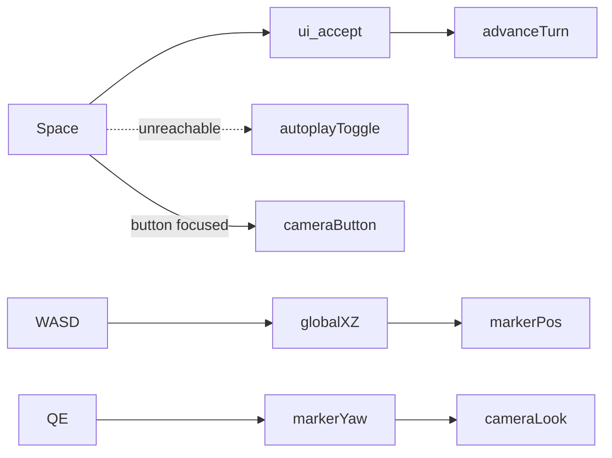

# Run J Planning — Dark Fantasy Reuse, 3D Wizard World, and Micro Combat Adaptation

**Date:** 2026-06-12  
**Branch:** `milestone/run-j-planning-dark-fantasy-reuse`  
**Status:** Planning complete — **do not implement Run J from this branch**  
**Authoritative for:** actual Run J implementation prompt at end of this document

---

## Table of contents

1. [Current 3D mode issues audit](#1-current-3d-mode-issues-audit)
2. [Files involved / Run J scope and avoid list](#2-files-involved--run-j-scope-and-avoid-list)
3. [Donor project comparison](#3-donor-project-comparison)
4. [Asset reuse matrix summary + Run J shortlist](#4-asset-reuse-matrix-summary--run-j-shortlist)
5. [Drafting status](#5-drafting-status)
6. [Run J implementation phases + tests 1–24](#6-run-j-implementation-phases--tests-124)
7. [Micro Combat and AI Training Adaptation Plan](#7-micro-combat-and-ai-training-adaptation-plan)
8. [Reuse recommendation table](#8-reuse-recommendation-table)
9. [Planning conclusions](#9-planning-conclusions)
10. [Checks run during planning](#10-checks-run-during-planning)
11. [Unresolved decisions for Joe](#11-unresolved-decisions-for-joe)
12. [Revised Run J Implementation Prompt](#12-revised-run-j-implementation-prompt)

---

## 1. Current 3D mode issues audit

### Summary

The wizard-world mode (`wizard_world_mode.tscn`, F5 main scene) combines a read-only macro `BotGameSession`, procedural 3D board visuals, and a **cosmetic** wizard marker. Seven confirmed or likely issues block comfortable exploration and mislead help text.

### Issue register

| # | Issue | Evidence | File / function | Recommended fix | Tests before impl | Manual smoke | Risk |
|---|---|---|---|---|---|---|---|
| 1 | `ui_accept` advances simulation | L41–42: `event.is_action_pressed("ui_accept")` → `_advance_simulation_step()` | `wizard_world_mode.gd` `_unhandled_input` | Remove `ui_accept` handler; use explicit `KEY_ENTER` / `KEY_N` only | Test 1, 2 | Enter/N advance one turn; Space does not | Low |
| 2 | Godot default `ui_accept` includes Space | No custom InputMap override in `project.godot`; Godot 4 defaults bind Space, Enter, Kp Enter | `project.godot` | Same as #1; document InputMap if global change needed | Test 1 | Space does not advance | Low |
| 3 | Space unsafe — autoplay never toggles | `ui_accept` returns early; `KEY_SPACE` block (L49) unreachable when Space pressed | `wizard_world_mode.gd` | Move autoplay to `KEY_P`; fix help text | Test 3, 4 | P toggles autoplay; help accurate | Low |
| 4 | Focusable UI reacts to Space | `CameraToggleButton` uses default `FOCUS_ALL`; Space activates button + may advance | `wizard_world_mode.tscn` | `focus_mode = FOCUS_NONE` on overlay buttons; or `_gui_input` consume | Test 1 | Space with button focused does not advance | Medium |
| 5 | WASD is global X/Z, not yaw-relative | `compute_move_delta` uses fixed -Z/+X; yaw updated separately without rotating move | `wizard_movement_input.gd`, `wizard_world_controller.gd` | Rotate delta by `marker_yaw_rad`; same basis as camera (`sin/cos`) | Tests 5–10 | After Q/E turn, W moves forward relative to facing | Medium |
| 6 | Board / world too small | `HEX_SIZE=1.0`, `HEX_RADIUS=0.42`, tiny procedural meshes | `board_node_anchors.gd`, `board_state_visualizer.gd` | Centralise scale; increase `HEX_SIZE` and visual radii together | Tests 11–15 | Board readable at wizard eye height | Medium |
| 7 | Walk speed wrong for 5 hex / 180 s | 5 centre spacings ≈ `5 * sqrt(3) * HEX_SIZE` ≈ 8.66 at scale 1; at speed 3.0 → ~2.9 s | `wizard_movement_input.gd` `DEFAULT_MOVE_SPEED` | `walk_speed = 5 * sqrt(3) * HEX_SIZE / 180.0` | Tests 13–14 | Hold W ~180 s crosses ~5 hex centres | Low |
| 8 | Camera / movement yaw convention split | Camera uses `Vector3(sin(yaw), 0, cos(yaw))`; movement ignores yaw | `wizard_camera_rig.gd`, `wizard_movement_input.gd` | Shared helper e.g. `WizardOrientation.forward(yaw)` | Tests 6–8 | W at yaw π/2 matches camera forward | Medium |

### Input flow (current)



---

## 2. Files involved / Run J scope and avoid list

### Primary files (3D wizard world)

| Layer | Files |
|---|---|
| Run mode | `godot_game/run_modes/wizard_world_mode.gd`, `.tscn` |
| Controller | `godot_game/integration/wizard_world_controller.gd` |
| Movement / camera | `godot_game/embodied/player/wizard_movement_input.gd`, `wizard_camera_rig.gd` |
| Board mapping / visuals | `godot_game/integration/board_node_anchors.gd`, `board_world_mapper.gd`, `board_state_visualizer.gd` |
| Card view models | `godot_game/ui/board/strategic_draft_view_model.gd`, `strategic_development_view_model.gd`, `strategic_card_display_presenter.gd` |
| Tests | `test_wizard_movement_input.gd`, `test_wizard_camera_rig.gd`, `test_wizard_world_controller.gd`, `test_strategic_draft_view_model.gd` |

### What Run J should implement

- Input isolation (no Space advance; explicit turn keys; autoplay on P)
- Yaw-relative WASD aligned with camera convention
- Centralised world scale + walk speed calibration (5 hex / 180 s)
- Manifest-driven billboards from dark_fantasy shortlist (see §4)
- Read-only 3D draft/card display from existing view models (drafting confirmed)
- Documentation + manual smoke checklist

### What Run J must deliberately avoid

- Rewriting or replacing `SpellCombatSession` / Run H combat rules
- Importing `DuelSim`, `MageSim`, or donor AI into `godot_game/core/`
- Bulk unstructured asset imports (use manifest + target folders)
- Mutating `GameState` from wizard movement or card display
- Merging donor scripts into core
- Human `DRAFT_PICK` submit UI (defer to M22 / Impl I4)
- Integrating tactical combat into macro loop

### Architecture constraints (unchanged)

- `godot_game/core/` headless, deterministic, rules-first
- UI / 3D / embodied submit legal actions only
- Donor combat informs adapters only, with test coverage

---

## 3. Donor project comparison

| Criterion | dark_fantasy | KF_wizard_game | board_game_M13 |
|---|---|---|---|
| 3D hex / world visual language | Rich: `World/GameWorld3D/`, forest Cairn sprites, panoramas | `HexTile3D_Base.tscn`, `GameLevel.tscn` — older 3D hex scenes | None (headless core only) |
| Billboard / directional sprites | Extensive class sprites under `EnemyNPC/*Sprites/`; Rogue/Shaman walk sets | `actors/`, `objects/` — mixed 3D + sprites | None |
| Spell icons | ~40 icons in `Spells/icons/` (1024² JPEG/PNG) | Limited | None |
| Terrain / forest | Cairn tree PNGs T1–T3, floor art | Scene props | None |
| Card / UI examples | Menu images, HUD icons, casting minigames | Debug overlays | Debug UI only |
| Combat UI | In-world spell casting, `GameMageView.gd` | Encounter scenes | None |
| Combat simulation | `DuelSim` + `MageSim` tick-based duels | Unknown / minimal | None |
| Training / AI | `EvoEngine`, `SimplePolicyNN`, `evo_brains/`, `evo_logs/` | None | Bot policies only |
| Architecture fit | Assets yes; sim code conflicts with turn-based core | Reference for 3D scene layout | Rules reference only |
| Ease of reuse | High for art; low for sim code | Medium for scene ideas | Low for visuals |
| Risk | Bulk import / sim merge | Outdated patterns | Accidental core merge |

**Recommendation:** Use **dark_fantasy** as primary visual donor; **KF_wizard_game** for 3D scene structure reference only; **board_game_M13** not for Run J visuals.

Align Run J visuals with Run I **Impl I2 / I6** ([IMPLEMENTATION_PLAN_3D_UI.md](IMPLEMENTATION_PLAN_3D_UI.md)) and [BILLBOARD_SPRITE_ASSET_PIPELINE.md](BILLBOARD_SPRITE_ASSET_PIPELINE.md).

---

## 4. Asset reuse matrix summary + Run J shortlist

**Full inventory:** [donor_asset_reuse_matrix.csv](donor_asset_reuse_matrix.csv) — 338 rows (dark_fantasy + KF_wizard_game), generated by `scripts/audit_donor_assets.py`.

### Run J shortlist (~15 files)

| Role | Source path | Target | Notes |
|---|---|---|---|
| Wizard marker | `dark_fantasy/Characters/NPC/EnemyNPC/WizardSprites/Wizard.png` (1080², alpha) | `godot_game/assets/billboards/wizards/wizard_default.png` | Cosmetic marker + billboard |
| Demon / enemy | `dark_fantasy/Characters/NPC/EnemyNPC/ApostateSprites/Apostate.png` | `godot_game/assets/billboards/demons/demon_default.png` | Maps to macro demon token |
| Hero / NPC | `dark_fantasy/Characters/NPC/EnemyNPC/ClericSprites/Cleric.png` or `ApprenticeSprites/Apprentice.png` | `godot_game/assets/billboards/heroes/hero_default.png` | Hero billboard on board |
| Forest prop ×4 | `World/GameWorld3D/Hexagons/Forest/Cairn/T1_C1.png`, `T1_C2.png`, `T2_C1.png`, `T2_C3.png` | `godot_game/assets/billboards/props/` | Scatter on production hexes |
| Spell icons ×8 | `AidIcon`, `FireballIcon`, `SilenceIcon`, `ShieldIcon`, `QuickenIcon`, `RegenIcon`, `BlightIcon`, `FocusIcon` | `godot_game/assets/billboards/ui_status/` | Match `spell_catalog_v1.json` ids |
| Hex floor (review) | `World/Art/floors/` (pick one after scale test) | `godot_game/assets/terrain/` | **Needs manual review** at target `HEX_SIZE` |

### Defer to later runs

- Full directional sprite sets (FireMage 8-way, Rogue/Shaman walk cycles)
- All spell icons (~40)
- Panoramas (`World/GameWorld3D/Panorama/`)
- Menu / title images
- Projectile / VFX sprites
- Donor `.gd` world scripts (`WorldHex.gd`, forest hex scenes)

### Reference only

- Donor UI screens, title art
- `DuelSim.gd`, `MageSim.gd`, `EvoEngine.gd` (code, not assets)
- `evo_brains/*.json` trained weights

---

## 5. Drafting status

**Drafting status:** **Confirmed**

**Evidence:**

- Core: `DraftRules`, `DRAFT_PICK` action, age decks, bot/human session flow (Run E)
- View models: `StrategicDraftViewModel.build()` reads `draft_packs_by_player`, `development_hand`, `waiting_for_draft`
- Presenter: `StrategicCardDisplayPresenter.format_card_line()` uses `DevelopmentCatalog`
- 12+ test modules registered in `test_registry.gd`

**Tests run (2026-06-12, planning branch):**

| Module | Result | Assertions |
|---|---|---|
| `TestStrategicDraftViewModel` | Passed | 9 |
| `TestDraftSession` | Passed | 8 |
| `TestDraftPickApply` | Passed | 4 |
| `TestStrategicCardDisplay` | Passed | 3 |

**Relevant files:**

- `godot_game/core/rules/draft_rules.gd`
- `godot_game/ui/board/strategic_draft_view_model.gd`
- `godot_game/ui/board/strategic_card_display_presenter.gd`

**What Run J should do:**

- Plan **read-only** 3D card display (Phase 5): billboards or HUD panel fed by `StrategicDraftViewModel` + `StrategicCardDisplayPresenter`
- Do **not** implement human draft pick in 3D (separate M22 / Impl I4 work)
- Do **not** block Run J on drafting — it is already implemented in core

---

## 6. Run J implementation phases + tests 1–24

### Phase 1 — Input isolation and test coverage

| | |
|---|---|
| **Purpose** | Stop Space advancing macro turns; fix help text |
| **Files** | `wizard_world_mode.gd`, `wizard_world_mode.tscn` |
| **Tests first** | 1–4 |
| **Notes** | Remove `ui_accept`; `KEY_P` autoplay; `FOCUS_NONE` on buttons |
| **Manual** | Space = camera or no-op; Enter/N = advance; P = autoplay |
| **Risks** | Global InputMap side effects if changed project-wide |
| **Rollback** | Revert input block only |

### Phase 2 — Yaw-relative movement and camera convention

| | |
|---|---|
| **Purpose** | WASD follows Q/E facing; match camera forward |
| **Files** | `wizard_movement_input.gd`, `wizard_world_controller.gd`, optional `wizard_orientation.gd` |
| **Tests first** | 5–10 |
| **Notes** | `forward = Vector3(sin(yaw), 0, cos(yaw))`; strafe via perpendicular |
| **Manual** | Turn with Q/E; W walks where camera looks in wizard mode |
| **Risks** | Sign convention drift vs existing camera tests |
| **Rollback** | Keep global movement behind flag |

### Phase 3 — Board/world scale and walking-speed calibration

| | |
|---|---|
| **Purpose** | Readable world; 5 hex centre spacings in ~180 s walking |
| **Files** | New `world_presentation_scale.gd` (or similar), `board_node_anchors.gd`, `board_state_visualizer.gd`, `wizard_movement_input.gd`, `wizard_camera_rig.gd` |
| **Tests first** | 11–15 |
| **Notes** | `HEX_SIZE` TBD (Joe); `walk_speed = 5 * sqrt(3) * HEX_SIZE / 180` |
| **Manual** | Timer walk test across 5 hexes |
| **Risks** | Encounter proximity thresholds may need rescaling |
| **Rollback** | Scale constants revert independently |

### Phase 4 — Visual language + selected donor assets

| | |
|---|---|
| **Purpose** | Replace procedural boxes with manifest billboards |
| **Files** | `board_state_visualizer.gd`, new `godot_game/assets/billboards/manifest.json`, imported shortlist from §4 |
| **Tests first** | 21–24 |
| **Notes** | Follow [BILLBOARD_SPRITE_ASSET_PIPELINE.md](BILLBOARD_SPRITE_ASSET_PIPELINE.md); spell icons for status/card art only |
| **Manual** | Board entities show sprites; no missing textures |
| **Risks** | Large PNG memory; import settings |
| **Rollback** | Procedural fallback if manifest missing |

### Phase 5 — 3D draft/card display (read-only)

| | |
|---|---|
| **Purpose** | Show draft pack + hand in wizard-world when `waiting_for_draft` |
| **Files** | New `wizard_world_draft_presenter.gd` (presentation only), wire in `wizard_world_mode.gd` |
| **Tests first** | 16–20 |
| **Notes** | Read `StrategicDraftViewModel`; no `GameState` mutation |
| **Manual** | Advance to draft round; cards visible |
| **Risks** | UI clutter in 3D |
| **Rollback** | Hide panel; 2D mode unchanged |

### Phase 6 — Documentation and smoke tests

| | |
|---|---|
| **Purpose** | Update run_modes.md, manual checklist, PROJECT_STATUS |
| **Files** | `docs/run_modes.md`, help text in `wizard_world_mode.gd` |
| **Tests first** | Full suite |
| **Manual** | Complete smoke checklist (§12) |
| **Risks** | Doc drift |
| **Rollback** | N/A |

### Phase 7 — Combat/training follow-up (documentation only in Run J)

| | |
|---|---|
| **Purpose** | Point to §7; no sim migration in Run J |
| **Files** | This doc, optional `docs/RUN_J2_MICRO_COMBAT_ADAPTER_PLAN.md` stub |
| **Tests first** | N/A in Run J |
| **Notes** | Spell/class **visuals** only in Phase 4 |
| **Manual** | Confirm tactical combat replay mode still works |
| **Risks** | Scope creep into DuelSim port |
| **Rollback** | N/A |

### Run J tests 1–24 (write before implementation)

**Input**

1. Space does not advance simulation  
2. Enter/N advance simulation  
3. C/Space toggle camera only (after input fix)  
4. P toggles autoplay only  

**Movement**

5. WASD movement is yaw-relative  
6. At yaw 0, W moves along chosen forward vector  
7. At yaw π/2, W moves per yaw convention  
8. A/D strafe relative to yaw  
9. Q/E update yaw  
10. Movement does not mutate `GameState`  

**Scale / speed**

11. Board scale constants centralised  
12. Hex centre spacing derived from `HEX_SIZE`  
13. `walking_speed = five_hex_centre_spacings / 180`  
14. 180 s simulated W movement ≈ five hex centres (tolerance band)  
15. Camera overview derives from board/world scale  

**Card display**

16. Card display model built from draft/development view model  
17. Card display does not mutate `GameState`  
18. Empty / no-draft state handled  
19. Active draft pack handled  
20. Current player hand / developments handled  

**Asset reuse**

21. Manifest references files that exist  
22. No missing imported textures  
23. Asset paths under agreed target folders  
24. Donor source paths recorded in manifest notes  

**Deferred to Run J2/Run K (document only, not Run J suite):** adapter tests 25–28 from original brief; see §7 micro combat tests 1–12.

---

## 7. Micro Combat and AI Training Adaptation Plan

### Audit summary

**What dark_fantasy simulates:** Head-to-head mage duels between two `MageSim` actors with 10-slot weaves, continuous tick loop (`dt=0.05`, max 720 s), inflight cast times, cooldowns, DoTs, barriers, shields, silence, rate buffs/debuffs, regen, and AI policies choosing slot actions or wait.

**Sim model:** **Tick-based real-time** with event-like cast completion — not turn-based. Hybrid: continuous clock + discrete spell slots.

**Current project model:** **`SpellCombatSession`** — turn-based tactical steps, `SpellCombatStatusRules` (Run H), JSON catalogue `spell_catalog_v1.json` (35 spells, sourced from same design workbook as dark fantasy). Already field-aligned with `SpellSimDef` / `SpellDefinition`.

**Key finding:** Spell **data** is largely already ported (workbook → JSON). Donor **runtime** (`DuelSim`/`MageSim`) differs in clock and dual-cast/counter chains. Donor **AI/training** (`EvoEngine`, evolution on NN weights) is separate from current `core/ml/` BC/baseline harness.

### Combat adaptation matrix

| dark_fantasy feature | current project equivalent | compatibility | recommended action | target run | tests required |
|---|---|---|---|---|---|
| spell definitions | `SpellDefinition`, `spell_catalog_v1.json` | High (fields align) | Reference only | Do not schedule | MC-2, MC-3 |
| spell registry | `SpellCatalog.load_default()` | High | Reference only | Do not schedule | MC-6 |
| class/archetype loadouts | `combatant_loadouts_v1.json`, `CombatantSpellLoadout` | Medium | Adapt later | Run J2 | MC-6, MC-7 |
| cooldowns | `SpellCombatRules.can_cast`, session cooldown map | Medium (turn vs tick) | Adapt later | Run K | MC-3, MC-11 |
| cast times | Donor inflight casts; current turn cast step | Low | Reference only | Run K | MC-3 |
| mana costs | `SpellCombatRules` mana gate | High | Reference only | Do not schedule | MC-3 |
| damage | `SpellCombatRules` instant damage | High | Reference only | Do not schedule | MC-4, MC-11 |
| healing | instant heal in rules | High | Reference only | Do not schedule | MC-4 |
| shields/barriers | `SpellCombatStatusRules` (Run H) | High | Reference only | Do not schedule | MC-4, MC-12 |
| silence | status engine + `can_cast` lockout | High | Reference only | Do not schedule | MC-4 |
| regen | session regen tick + status deltas | Medium | Adapt later | Run K | MC-4 |
| wither/anti-regen | debuff regen deltas in catalogue | Medium | Adapt later | Run K | MC-4, MC-5 |
| haste/quicken | cast/CD rate mult buffs | Medium | Adapt later | Run K | MC-4 |
| DoT effects | `SpellCombatStatusRules` DoT tick | High | Reference only | Do not schedule | MC-4 |
| buffs/debuffs | status engine durations | High | Reference only | Do not schedule | MC-4 |
| lifesteal/drain | `lifesteal_frac` in rules | Medium | Adapt later | Run K | MC-4 |
| AI action selection | `SimpleController.decide_and_act` | Low (tick sim) | Needs prototype | Experimental sandbox | MC-7, MC-8 |
| legal action masks | `SimpleController._build_legal_mask_sim` | Medium | Adapt later | Run K | MC-7 |
| policy networks | `SimplePolicyNN`, `PolicyAdapter` | Low | Needs prototype | Experimental sandbox | MC-8, MC-9 |
| evolution/training loop | `EvoEngine`, `EvoTrainer` | Low | Adapt later | Experimental sandbox | MC-9 |
| CSV logging/telemetry | `LoggerCSV`, `evo_logs/` | High (pattern) | Adapt later | Run K | MC-9 |
| verbose duel traces | `DuelSimVerbose` | Medium | Reference only | Experimental sandbox | MC-9 |
| trained brain artefacts | `evo_brains/*.json` | Low (format) | Reject | Do not schedule | — |
| spell icons | `Spells/icons/*` | High | **Use now** | **Run J** | 21–24 |
| class visual identity | `*Sprites/*.png` | High | **Use now** | **Run J** | 21–24 |

### Micro combat audit questions (answers)

1. **What does it simulate?** 1v1 mage duel with weave slots, resources, statuses, AI or human policies.  
2. **Clock model?** Tick-based real-time (`dt=0.05`).  
3. **Spells?** `SpellSimDef` Resource + per-spell `.gd` scripts in donor; JSON catalogue in current game.  
4. **Effect representation?** Exported fields on `SpellSimDef`; runtime arrays on `MageSim` for DoTs, buffs, silence, barrier, shield.  
5. **AI selection?** Feature vector + legal 11-action mask (10 slots + wait) → `PolicyAdapter` → `pick_action_simple`.  
6. **Training optimises?** Win rate, time-to-kill, control damage; evolutionary population over NN weights.  
7. **Logs?** `LoggerCSV`, verbose duel logs under `evo_logs/`, brain JSON snapshots.  
8. **Maps cleanly?** Data fields, CSV logging patterns, spell icons, legal-mask **concept**.  
9. **Conflicts?** Continuous sim vs turn session; dual_cast/counter chains deferred in Run H; donor scene dependencies; evo brain format.  
10. **Run J use?** **Reference only** for combat code; **Use now** for visual assets only.

### Future test plan (micro combat adaptation — Run J2/K, not Run J)

| ID | Test |
|---|---|
| MC-1 | Donor spell definitions parse into neutral DTOs without scene/UI dependencies |
| MC-2 | Donor spell names map to current taxonomy or marked new |
| MC-3 | Cooldown/cast-time/mana fields preserved correctly |
| MC-4 | Damage/heal/shield/silence/regen/wither map to effect categories |
| MC-5 | Unsupported donor effects rejected/flagged, not silently ignored |
| MC-6 | Donor-inspired catalogue loads headlessly |
| MC-7 | AI legal action masks deterministic |
| MC-8 | Policy input features deterministic and documented |
| MC-9 | Training/evolution logs emit as CSV |
| MC-10 | Adapted sim does not mutate macro `GameState` |
| MC-11 | Existing `SpellCombatSession` tests still pass |
| MC-12 | Run H fidelity matrix remains source of truth unless superseded by explicit decision |

### Planning conclusion (micro combat track)

```text
Micro combat recommendation:
  Visual-only reuse in Run J (spell icons, class billboards). Do not replace
  SpellCombatSession or import DuelSim/MageSim. Run H fidelity matrix stays authoritative.

AI/training recommendation:
  Defer EvoEngine/EvoTrainer port. Reference legal-mask + feature-vector ideas and
  LoggerCSV patterns for a headless Experimental sandbox or Run K. Reject direct
  reuse of evo_brains/*.json weights.

Spell catalogue recommendation:
  Keep spell_catalog_v1.json authoritative (already derived from dark fantasy workbook).
  Run J2: optional DonorSpellDto adapter from SpellSimDef/specs for gap analysis only —
  not a runtime replacement.

What to use in Run J:
  Spells/icons (8), Wizard/Apostate/Cleric sprites, 4 Cairn trees, manifest pipeline.

What to defer to Run J2 / Run K:
  SpellSimDef→DTO adapter prototype; legal action masks for micro RL; CSV duel logging
  enhancements; regen/wither/haste parity review under turn-based clock.

What not to use:
  DuelSim, MageSim, EvoEngine runtime imports; evo_brains weights; donor spell .gd scripts;
  continuous-time merge without migration plan.

Prototype branch recommended: yes
  milestone/run-j2-micro-combat-donor-adapter (headless DTO + mapping tests MC-1–MC-6 only)

First tests to write:
  MC-1, MC-2, MC-5, MC-11 (adapter canary + no regression on SpellCombatSession)
```

---

## 8. Reuse recommendation table

| Category | Recommendation | Source | Target | Use in Run J? | Reason |
|---|---|---|---|---|---|
| Wizard/player sprite | Use directly | `WizardSprites/Wizard.png` | `assets/billboards/wizards/` | Yes | Cosmetic marker + visual language |
| Enemy/demon sprite | Use directly | `ApostateSprites/Apostate.png` | `assets/billboards/demons/` | Yes | Macro demon billboard |
| Hero/NPC sprite | Use directly | `ClericSprites/Cleric.png` | `assets/billboards/heroes/` | Yes | Hero token readability |
| Terrain/hex texture | Adapt | `World/Art/floors/` | `assets/terrain/` | Review | Needs scale validation |
| Tree/grass sprites | Use directly | Cairn T1/T2 PNGs (×4) | `assets/billboards/props/` | Yes | Forest hex dressing |
| Spell icons | Use directly | 8 icons (§4) | `assets/billboards/ui_status/` | Yes | Cards + combat UI art |
| Card icons | Use directly | Same spell icons + dev catalog mapping | `assets/billboards/ui_status/` | Yes | Draft display Phase 5 |
| Billboard rendering code | Adapt | Run I pipeline + new manifest loader | `integration/` or `ui/` | Yes | Impl I6 |
| World/hex rendering code | Adapt | `board_state_visualizer.gd` only | `integration/` | Yes | No donor script import |
| Combat simulation code | Reject | `DuelSim.gd`, `MageSim.gd` | — | No | Conflicts with SpellCombatSession |
| Training/evolution code | Defer | `EvoEngine.gd`, `EvoTrainer.gd` | experimental sandbox | No | Separate milestone |
| CSV logging ideas | Adapt | `LoggerCSV.gd` pattern | `core/export/` or `core/ml/` | No (Run K) | Pattern reuse only |

---

## 9. Planning conclusions

Run J is a **3D wizard-world presentation milestone** with strict boundaries: fix input/movement/scale, import a **small manifest-backed asset set** from dark_fantasy, add read-only 3D draft display, and **do not** migrate combat sim or training code.

Micro combat and AI training adaptation is a **parallel deferred track** (Run J2/K + experimental sandbox) documented in §7.

---

## 10. Checks run during planning

| Check | Result |
|---|---|
| Branch `milestone/run-j-planning-dark-fantasy-reuse` | Created from `main` |
| `python3 scripts/audit_donor_assets.py` | 338 rows → `donor_asset_reuse_matrix.csv` (Pillow OK) |
| `TestStrategicDraftViewModel` | Passed (9) |
| `TestDraftSession` | Passed (8) |
| `TestDraftPickApply` | Passed (4) |
| `TestStrategicCardDisplay` | Passed (3) |
| Full test suite | **Passed** — 152,857 assertions, 0 failed, exit 0 (~13 min). Godot reported CanvasItem/RID leak warnings at shutdown (non-failing). |

---

## 11. Unresolved decisions for Joe

1. Target `HEX_SIZE` (e.g. 8, 12, 16) — drives all scale + walk speed  
2. Camera toggle: Space vs C vs both (after `ui_accept` fix)  
3. Autoplay key: P (recommended) vs other  
4. Final sprite picks from CSV shortlist  
5. 3D card display: floating billboards vs HUD overlay vs table prop  
6. Combat adapter timing: Run J2 vs Run K vs experimental sandbox  
7. Prototype donor DTO adapter before any mechanics merge (recommended: yes)  
8. Evo training: reference-only vs future sandbox port  

---

## 12. Revised Run J Implementation Prompt

Copy-paste ready for the implementation agent after human approval of this planning doc.

```markdown
# Run J Implementation — 3D wizard world, scale, visual language, cards

## Context

Implement Run J from docs/RUN_J_PLANNING_DARK_FANTASY_REUSE.md on branch
`milestone/run-j-3d-wizard-world` (create from main after planning PR merge).

This is implementation, not planning. Follow tests-first and milestone workflow.

## Scope

### In scope (phases 1–6)

1. Input isolation: remove ui_accept advance; Enter/N only; P autoplay; fix help text;
   FOCUS_NONE on overlay buttons; Space/C for camera only.
2. Yaw-relative WASD using same convention as WizardCameraRig (sin/cos yaw).
3. Centralise WorldPresentationScale (HEX_SIZE TBD by Joe — default propose 12);
   walk_speed = 5 * sqrt(3) * HEX_SIZE / 180.
4. Import Run J asset shortlist via manifest.json under godot_game/assets/billboards/
   (Wizard, Apostate, Cleric, 4 Cairn trees, 8 spell icons). Record donor paths.
5. Read-only 3D draft/card display from StrategicDraftViewModel + StrategicCardDisplayPresenter.
6. Update docs/run_modes.md + manual smoke checklist.

### Explicitly out of scope

- No SpellCombatSession / Run H rule changes
- No DuelSim, MageSim, EvoEngine imports into core
- No bulk asset imports outside manifest
- No GameState mutation from movement or card display
- No human DRAFT_PICK 3D UI
- No macro/tactical combat integration

### Deferred follow-up track (Run J2 / Run K — do NOT implement in Run J)

Micro Combat and AI Training Adaptation Plan (§7 of planning doc):
- Headless SpellSimDef → neutral DTO adapter prototype
- 12 MC tests (MC-1–MC-12)
- Experimental sandbox for EvoEngine-style training ideas
- Branch: milestone/run-j2-micro-combat-donor-adapter

Run J may use dark_fantasy combat material ONLY as visual assets (spell icons, class billboards).

## Tests first (Run J suite)

Write failing tests before implementation for items 1–24 in planning doc §6.
Run full suite before merge:

  scripts/invoke-godot-headless.sh --headless --path godot_game \
    -s res://tests/test_runner.gd

## Manual smoke checklist

- [ ] Space does not advance macro turn
- [ ] Enter/N advances one bot turn
- [ ] P toggles autoplay
- [ ] C or Space toggles camera (per Joe decision)
- [ ] WASD moves relative to Q/E facing
- [ ] ~180 s walk crosses ~5 hex centres
- [ ] Board sprites visible; no pink missing textures
- [ ] Draft pack visible when waiting_for_draft (read-only)
- [ ] Wizard movement does not change demon counts / VP
- [ ] Spell combat replay / isolated modes still work unchanged

## Architecture

- core/ headless; presentation in run_modes/, integration/, ui/, embodied/
- Asset manifest required for all imported PNGs

## Deliverable

PR from milestone/run-j-3d-wizard-world; do not merge without human review and green tests.
```

---

*End of Run J planning document.*
