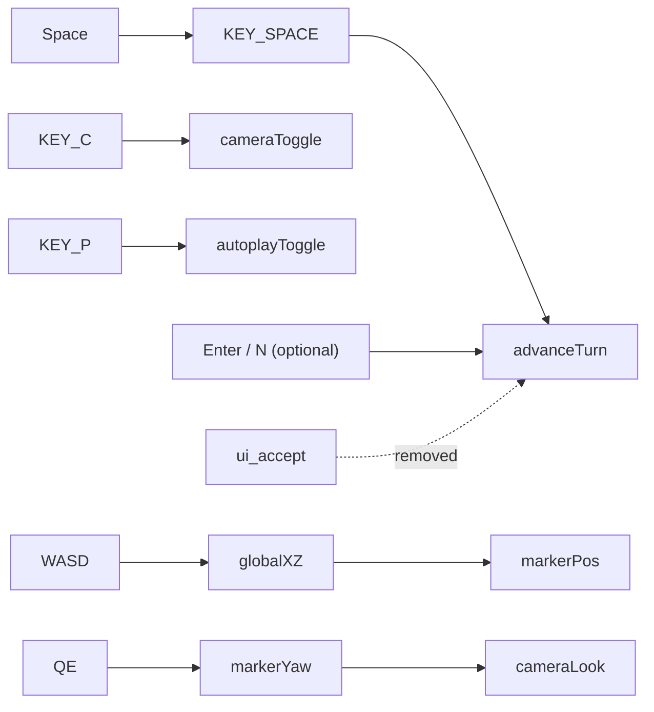

# Run J Planning — Dark Fantasy Reuse, 3D Wizard World, and Micro Combat Adaptation

**Date:** 2026-06-12  
**Branch:** `milestone/run-j-planning-dark-fantasy-reuse`  
**Status:** Planning complete with Joe's final decisions — **do not implement Run J from this branch**  
**Authoritative for:** actual Run J implementation prompt at end of this document

---

## Table of contents

1. [Current 3D mode issues audit](#1-current-3d-mode-issues-audit)
2. [Files involved / Run J scope and avoid list](#2-files-involved--run-j-scope-and-avoid-list)
3. [Donor project comparison](#3-donor-project-comparison)
4. [Asset reuse matrix summary + Run J shortlist](#4-asset-reuse-matrix-summary--run-j-shortlist)
5. [Drafting status](#5-drafting-status)
6. [Run J implementation phases + tests 1–24](#6-run-j-implementation-phases--tests-124)
7. [Micro Combat and AI Training Adaptation Plan](#7-micro-combat-and-ai-training-adaptation-plan)
8. [Reuse recommendation table](#8-reuse-recommendation-table)
9. [Planning conclusions](#9-planning-conclusions)
10. [Checks run during planning](#10-checks-run-during-planning)
11. [Remaining decisions (minimal)](#11-remaining-decisions-minimal)
12. [Revised Run J Implementation Prompt](#12-revised-run-j-implementation-prompt)

---

## 1. Current 3D mode issues audit

### Summary

The wizard-world mode (`wizard_world_mode.tscn`, F5 main scene) combines a read-only macro `BotGameSession`, procedural 3D board visuals, and a **cosmetic** wizard marker. Seven confirmed or likely issues block comfortable exploration and mislead help text. Joe's final input decision: **`KEY_SPACE` advances turns explicitly** (not via `ui_accept`); **`KEY_C`** camera; **`KEY_P`** autoplay.

### Issue register

| # | Issue | Evidence | File / function | Recommended fix | Tests before impl | Manual smoke | Risk |
|---|---|---|---|---|---|---|---|
| 1 | Space must advance **only** via explicit `KEY_SPACE` | L41–42: `event.is_action_pressed("ui_accept")` → `_advance_simulation_step()` — wrong path | `wizard_world_mode.gd` `_unhandled_input` | Remove `ui_accept` advance handler; add explicit `KEY_SPACE` → `_advance_simulation_step()` | Test 1, 2 | Space advances one turn via `KEY_SPACE` only | Low |
| 2 | Godot default `ui_accept` includes Space | No custom InputMap override in `project.godot`; Godot 4 defaults bind Space, Enter, Kp Enter | `project.godot` | Do **not** use `ui_accept` for advance; do **not** rely on Godot default InputMap | Test 1, 2 | Space does not advance through `ui_accept` | Low |
| 3 | Space must not toggle camera or autoplay | `KEY_SPACE` block (L49) conflates autoplay; camera toggle unclear | `wizard_world_mode.gd` | `KEY_C` toggles camera; `KEY_P` toggles autoplay; `KEY_SPACE` advances only | Test 3, 4 | C = camera; P = autoplay; Space = advance only | Low |
| 4 | Focusable UI steals Space | `CameraToggleButton` uses default `FOCUS_ALL`; Space activates button instead of advancing | `wizard_world_mode.tscn` | `focus_mode = FOCUS_NONE` on overlay buttons so Space reaches explicit handler | Test 1 | Space with UI visible still advances turn | Medium |
| 5 | WASD is global X/Z, not yaw-relative | `compute_move_delta` uses fixed -Z/+X; yaw updated separately without rotating move | `wizard_movement_input.gd`, `wizard_world_controller.gd` | Rotate delta by `marker_yaw_rad`; same basis as camera (`sin/cos`) | Tests 5–10 | After Q/E turn, W moves forward relative to facing | Medium |
| 6 | Board / world too small | `HEX_SIZE=1.0`, `HEX_RADIUS=0.42`, tiny procedural meshes | `board_node_anchors.gd`, `board_state_visualizer.gd` | Centralise scale; set **`HEX_SIZE = 16`** and visual radii together | Tests 11–15 | Board readable at wizard eye height | Medium |
| 7 | Walk speed wrong for 5 hex / 180 s | 5 centre spacings ≈ `5 * sqrt(3) * HEX_SIZE` ≈ 8.66 at scale 1; at speed 3.0 → ~2.9 s | `wizard_movement_input.gd` `DEFAULT_MOVE_SPEED` | `hex_centre_spacing = sqrt(3) * HEX_SIZE`; `five_hex_distance = 5 * sqrt(3) * HEX_SIZE`; `walk_speed = five_hex_distance / 180` → at `HEX_SIZE=16`: spacing ≈ 27.71, five_hex ≈ 138.56, walk_speed ≈ 0.77 u/s | Tests 13–14 | Hold W ~180 s crosses ~5 hex centres (±5%) | Low |
| 8 | Camera / movement yaw convention split | Camera uses `Vector3(sin(yaw), 0, cos(yaw))`; movement ignores yaw | `wizard_camera_rig.gd`, `wizard_movement_input.gd` | Shared helper e.g. `WizardOrientation.forward(yaw)` | Tests 6–8 | W at yaw π/2 matches camera forward | Medium |

### Input flow (current)



---

## 2. Files involved / Run J scope and avoid list

### Primary files (3D wizard world)

| Layer | Files |
|---|---|
| Run mode | `godot_game/run_modes/wizard_world_mode.gd`, `.tscn` |
| Controller | `godot_game/integration/wizard_world_controller.gd` |
| Movement / camera | `godot_game/embodied/player/wizard_movement_input.gd`, `wizard_camera_rig.gd` |
| Board mapping / visuals | `godot_game/integration/board_node_anchors.gd`, `board_world_mapper.gd`, `board_state_visualizer.gd` |
| Development view models | `godot_game/ui/board/strategic_development_view_model.gd`, `strategic_card_display_presenter.gd` (`strategic_draft_view_model.gd` — 2D/M22 only, not wizard 3D) |
| Tests | `test_wizard_movement_input.gd`, `test_wizard_camera_rig.gd`, `test_wizard_world_controller.gd`, `test_strategic_draft_view_model.gd` |

### What Run J should implement

- Input: explicit **`KEY_SPACE`** advances one simulation step (primary); **`KEY_C`** toggles camera; **`KEY_P`** toggles autoplay; optional **`KEY_ENTER` / `KEY_N`** aliases for advance if low risk; **no `ui_accept`** for advance; do not rely on Godot default InputMap
- UI overlay buttons use **`FOCUS_NONE`** so Space is not stolen
- Yaw-relative WASD aligned with camera convention (Space does **not** move wizard)
- Centralised world scale with **`HEX_SIZE = 16`** and walk speed calibration (5 hex / 180 s)
- Manifest-driven billboards from dark_fantasy shortlist — **implementation agent picks final sprites from CSV** (prefer readable at `HEX_SIZE=16`, transparency, dark mythic style)
- **Hybrid** built-development indicators on city vertices: generic slot markers + per-card icon where asset exists + fallback generic (read-only via `StrategicDevelopmentViewModel`, `DevelopmentCatalog`, manifest)
- Documentation + manual smoke checklist

### What Run J must deliberately avoid

- Rewriting or replacing `SpellCombatSession` / Run H combat rules
- Importing `DuelSim`, `MageSim`, `EvoEngine`, `EvoTrainer`, or donor AI into `godot_game/core/`
- Donor DTO adapter work (deferred to **`milestone/run-j2-micro-combat-donor-adapter`**, MC-1–MC-6)
- Evo training / `evo_brains/*.json` (reference-only; future sandbox after DTO)
- Bulk unstructured asset imports (use manifest + target folders)
- Mutating `GameState` from wizard movement or development display
- Merging donor scripts into core
- Human `DRAFT_PICK` submit UI (defer to M22 / Impl I4)
- Integrating tactical combat into macro loop
- Any combat sim migration (Run J is **visual-only** for dark_fantasy combat material)

### Architecture constraints (unchanged)

- `godot_game/core/` headless, deterministic, rules-first
- UI / 3D / embodied submit legal actions only
- Donor combat informs adapters only, with test coverage

---

## 3. Donor project comparison

| Criterion | dark_fantasy | KF_wizard_game | board_game_M13 |
|---|---|---|---|
| 3D hex / world visual language | Rich: `World/GameWorld3D/`, forest Cairn sprites, panoramas | `HexTile3D_Base.tscn`, `GameLevel.tscn` — older 3D hex scenes | None (headless core only) |
| Billboard / directional sprites | Extensive class sprites under `EnemyNPC/*Sprites/`; Rogue/Shaman walk sets | `actors/`, `objects/` — mixed 3D + sprites | None |
| Spell icons | ~40 icons in `Spells/icons/` (1024² JPEG/PNG) | Limited | None |
| Terrain / forest | Cairn tree PNGs T1–T3, floor art | Scene props | None |
| Card / UI examples | Menu images, HUD icons, casting minigames | Debug overlays | Debug UI only |
| Combat UI | In-world spell casting, `GameMageView.gd` | Encounter scenes | None |
| Combat simulation | `DuelSim` + `MageSim` tick-based duels | Unknown / minimal | None |
| Training / AI | `EvoEngine`, `SimplePolicyNN`, `evo_brains/`, `evo_logs/` | None | Bot policies only |
| Architecture fit | Assets yes; sim code conflicts with turn-based core | Reference for 3D scene layout | Rules reference only |
| Ease of reuse | High for art; low for sim code | Medium for scene ideas | Low for visuals |
| Risk | Bulk import / sim merge | Outdated patterns | Accidental core merge |

**Recommendation:** Use **dark_fantasy** as primary visual donor; **KF_wizard_game** for 3D scene structure reference only; **board_game_M13** not for Run J visuals.

Align Run J visuals with Run I **Impl I2 / I6** ([IMPLEMENTATION_PLAN_3D_UI.md](IMPLEMENTATION_PLAN_3D_UI.md)) and [BILLBOARD_SPRITE_ASSET_PIPELINE.md](BILLBOARD_SPRITE_ASSET_PIPELINE.md).

---

## 4. Asset reuse matrix summary + Run J shortlist

**Full inventory:** [donor_asset_reuse_matrix.csv](donor_asset_reuse_matrix.csv) — 338 rows (dark_fantasy + KF_wizard_game), generated by `scripts/audit_donor_assets.py`.

### Run J shortlist (~15 files)

**Final sprite selection:** delegated to the implementation agent — choose from [donor_asset_reuse_matrix.csv](donor_asset_reuse_matrix.csv) shortlist. Prefer assets that remain readable at **`HEX_SIZE=16`**, have transparency, and match the dark mythic visual language.

| Role | Source path (candidates) | Target | Notes |
|---|---|---|---|
| Wizard marker | `dark_fantasy/Characters/NPC/EnemyNPC/WizardSprites/Wizard.png` (1080², alpha) | `godot_game/assets/billboards/wizards/wizard_default.png` | Cosmetic marker + billboard |
| Demon / enemy | `dark_fantasy/Characters/NPC/EnemyNPC/ApostateSprites/Apostate.png` | `godot_game/assets/billboards/demons/demon_default.png` | Maps to macro demon token |
| Hero / NPC | `ClericSprites/Cleric.png`, `ApprenticeSprites/Apprentice.png`, or CSV alternative | `godot_game/assets/billboards/heroes/hero_default.png` | Agent picks best readability |
| Forest prop ×4 | `World/GameWorld3D/Hexagons/Forest/Cairn/T1_C1.png`, `T1_C2.png`, `T2_C1.png`, `T2_C3.png` | `godot_game/assets/billboards/props/` | Scatter on production hexes |
| Spell icons ×8 | `AidIcon`, `FireballIcon`, `SilenceIcon`, `ShieldIcon`, `QuickenIcon`, `RegenIcon`, `BlightIcon`, `FocusIcon` | `godot_game/assets/billboards/ui_status/` | Match `spell_catalog_v1.json` ids |
| Hex floor (review) | `World/Art/floors/` (pick one after scale test at `HEX_SIZE=16`) | `godot_game/assets/terrain/` | Validate at target scale |

### Defer to later runs

- Full directional sprite sets (FireMage 8-way, Rogue/Shaman walk cycles)
- All spell icons (~40)
- Panoramas (`World/GameWorld3D/Panorama/`)
- Menu / title images
- Projectile / VFX sprites
- Donor `.gd` world scripts (`WorldHex.gd`, forest hex scenes)

### Reference only

- Donor UI screens, title art
- `DuelSim.gd`, `MageSim.gd`, `EvoEngine.gd` (code, not assets)
- `evo_brains/*.json` trained weights

---

## 5. Drafting status

**Drafting status:** **Confirmed**

**Evidence:**

- Core: `DraftRules`, `DRAFT_PICK` action, age decks, bot/human session flow (Run E)
- View models: `StrategicDraftViewModel.build()` reads `draft_packs_by_player`, `development_hand`, `waiting_for_draft`
- Presenter: `StrategicCardDisplayPresenter.format_card_line()` uses `DevelopmentCatalog`
- 12+ test modules registered in `test_registry.gd`

**Tests run (2026-06-12, planning branch):**

| Module | Result | Assertions |
|---|---|---|
| `TestStrategicDraftViewModel` | Passed | 9 |
| `TestDraftSession` | Passed | 8 |
| `TestDraftPickApply` | Passed | 4 |
| `TestStrategicCardDisplay` | Passed | 3 |

**Relevant files:**

- `godot_game/core/rules/draft_rules.gd`
- `godot_game/ui/board/strategic_draft_view_model.gd`
- `godot_game/ui/board/strategic_card_display_presenter.gd`

**What Run J should do:**

- **No drafting UI in wizard-world mode** — draft picks are AI/bot gods only; human draft UX stays in 2D (M22 / Impl I4)
- Plan **read-only hybrid built-development visibility on cities** (Phase 5): generic slot markers at city vertices + per-card icon where manifest asset exists + fallback generic marker; data from `StrategicDevelopmentViewModel` + `DevelopmentCatalog` / manifest art
- Do **not** show draft pack, hand, or `waiting_for_draft` state in 3D
- Do **not** block Run J on drafting core — it is already implemented; wizard mode only reflects **built** state on the board

---

## 6. Run J implementation phases + tests 1–24

### Phase 1 — Input isolation and test coverage

| | |
|---|---|
| **Purpose** | Explicit `KEY_SPACE` advance; remove `ui_accept` advance; separate camera/autoplay keys; fix help text |
| **Files** | `wizard_world_mode.gd`, `wizard_world_mode.tscn` |
| **Tests first** | 1–4 |
| **Notes** | `KEY_SPACE` → advance (primary); `KEY_C` → camera; `KEY_P` → autoplay; optional `KEY_ENTER`/`KEY_N` aliases; `FOCUS_NONE` on buttons; do not use `ui_accept` or Godot default InputMap for advance |
| **Manual** | Space = advance; C = camera; P = autoplay; Enter/N = advance (if implemented); help text matches |
| **Risks** | Global InputMap side effects if changed project-wide |
| **Rollback** | Revert input block only |

### Phase 2 — Yaw-relative movement and camera convention

| | |
|---|---|
| **Purpose** | WASD follows Q/E facing; match camera forward |
| **Files** | `wizard_movement_input.gd`, `wizard_world_controller.gd`, optional `wizard_orientation.gd` |
| **Tests first** | 5–10 |
| **Notes** | `forward = Vector3(sin(yaw), 0, cos(yaw))`; strafe via perpendicular |
| **Manual** | Turn with Q/E; W walks where camera looks in wizard mode |
| **Risks** | Sign convention drift vs existing camera tests |
| **Rollback** | Keep global movement behind flag |

### Phase 3 — Board/world scale and walking-speed calibration

| | |
|---|---|
| **Purpose** | Readable world; 5 hex centre spacings in ~180 s walking |
| **Files** | New `world_presentation_scale.gd` (or similar), `board_node_anchors.gd`, `board_state_visualizer.gd`, `wizard_movement_input.gd`, `wizard_camera_rig.gd` |
| **Tests first** | 11–15 |
| **Notes** | **`HEX_SIZE = 16`** (Joe decision); `hex_centre_spacing = sqrt(3) * HEX_SIZE`; `five_hex_distance = 5 * sqrt(3) * HEX_SIZE`; `walk_speed = five_hex_distance / 180` (≈ 0.77 u/s at 16) |
| **Manual** | Timer walk test: 180 s forward movement ≈ five hex centre-spacings ±5% |
| **Risks** | Encounter proximity thresholds may need rescaling |
| **Rollback** | Scale constants revert independently |

### Phase 4 — Visual language + selected donor assets

| | |
|---|---|
| **Purpose** | Replace procedural boxes with manifest billboards |
| **Files** | `board_state_visualizer.gd`, new `godot_game/assets/billboards/manifest.json`, imported shortlist from §4 |
| **Tests first** | 21–24 |
| **Notes** | Implementation agent picks final sprites from CSV shortlist (§4); follow [BILLBOARD_SPRITE_ASSET_PIPELINE.md](BILLBOARD_SPRITE_ASSET_PIPELINE.md); spell icons for status/card art only |
| **Manual** | Board entities show sprites; no missing textures |
| **Risks** | Large PNG memory; import settings |
| **Rollback** | Procedural fallback if manifest missing |

### Phase 5 — Built development visibility on cities (read-only)

| | |
|---|---|
| **Purpose** | Show built development cards on city vertices (hybrid: generic slot markers + per-card icon + fallback) |
| **Files** | Extend `board_state_visualizer.gd` and/or new `wizard_world_development_presenter.gd`; wire via `wizard_world_controller.gd` |
| **Tests first** | 16–20 |
| **Notes** | Read `StrategicDevelopmentViewModel.city_slots` / `city.developments`; map card ids to manifest icons via `DevelopmentCatalog`; per-card icon where asset exists, else generic slot marker; no `GameState` mutation; no draft pack or hand UI |
| **Manual** | After bots build developments, city vertices show correct per-card indicators; draft rounds show no draft UI |
| **Risks** | Icon mapping gaps for 96-card catalogue; clutter at dense cities (max 3 slots) |
| **Rollback** | Hide development markers; city meshes unchanged |

### Phase 6 — Documentation and smoke tests

| | |
|---|---|
| **Purpose** | Update run_modes.md, manual checklist, PROJECT_STATUS |
| **Files** | `docs/run_modes.md`, help text in `wizard_world_mode.gd` |
| **Tests first** | Full suite |
| **Manual** | Complete smoke checklist (§12) |
| **Risks** | Doc drift |
| **Rollback** | N/A |

### Phase 7 — Combat/training follow-up (documentation only in Run J)

| | |
|---|---|
| **Purpose** | Point to §7; **no combat sim migration in Run J** — visual-only dark_fantasy reuse |
| **Files** | This doc, optional `docs/RUN_J2_MICRO_COMBAT_ADAPTER_PLAN.md` stub |
| **Tests first** | N/A in Run J |
| **Notes** | Spell/class **visuals** only in Phase 4; DTO adapter deferred to Run J2 (MC-1–MC-6); AI/training deferred to Run K / experimental sandbox |
| **Manual** | Confirm tactical combat replay mode still works |
| **Risks** | Scope creep into DuelSim port |
| **Rollback** | N/A |

### Run J tests 1–24 (write before implementation)

**Input**

1. `KEY_SPACE` advances simulation via explicit handler (not `ui_accept`)  
2. `KEY_ENTER` / `KEY_N` advance simulation when implemented as optional aliases (low risk)  
3. `KEY_C` toggles camera; `KEY_SPACE` does **not** toggle camera  
4. `KEY_P` toggles autoplay; `KEY_SPACE` does **not** toggle autoplay  

**Movement**

5. WASD movement is yaw-relative  
6. At yaw 0, W moves along chosen forward vector  
7. At yaw π/2, W moves per yaw convention  
8. A/D strafe relative to yaw  
9. Q/E update yaw  
10. Movement does not mutate `GameState`  

**Scale / speed**

11. Board scale constants centralised with **`HEX_SIZE = 16`**  
12. Hex centre spacing = `sqrt(3) * HEX_SIZE` (≈ 27.71 at 16)  
13. `walk_speed = five_hex_distance / 180` where `five_hex_distance = 5 * sqrt(3) * HEX_SIZE` (≈ 0.77 u/s at 16)  
14. 180 s simulated forward movement ≈ five hex centre-spacings ±5%  
15. Camera overview derives from board/world scale  

**Built development visibility**

16. Built-development display model derived from `StrategicDevelopmentViewModel` / `city.developments` (hybrid slot + per-card + fallback)  
17. Built-development display does not mutate `GameState`  
18. City with no built developments shows no indicators (or empty slot state)  
19. City with one or more built developments shows correct hybrid indicators (per-card icon where asset exists, else generic)  
20. Demon-occupied city still shows existing built developments until rules purge (read-only)  

**Asset reuse**

21. Manifest references files that exist  
22. No missing imported textures  
23. Asset paths under agreed target folders  
24. Donor source paths recorded in manifest notes  

**Deferred to Run J2/Run K (document only, not Run J suite):** adapter tests 25–28 from original brief; see §7 micro combat tests 1–12.

---

## 7. Micro Combat and AI Training Adaptation Plan

### Audit summary

**What dark_fantasy simulates:** Head-to-head mage duels between two `MageSim` actors with 10-slot weaves, continuous tick loop (`dt=0.05`, max 720 s), inflight cast times, cooldowns, DoTs, barriers, shields, silence, rate buffs/debuffs, regen, and AI policies choosing slot actions or wait.

**Sim model:** **Tick-based real-time** with event-like cast completion — not turn-based. Hybrid: continuous clock + discrete spell slots.

**Current project model:** **`SpellCombatSession`** — turn-based tactical steps, `SpellCombatStatusRules` (Run H), JSON catalogue `spell_catalog_v1.json` (35 spells, sourced from same design workbook as dark fantasy). Already field-aligned with `SpellSimDef` / `SpellDefinition`.

**Key finding:** Spell **data** is largely already ported (workbook → JSON). Donor **runtime** (`DuelSim`/`MageSim`) differs in clock and dual-cast/counter chains. Donor **AI/training** (`EvoEngine`, evolution on NN weights) is separate from current `core/ml/` BC/baseline harness.

### Combat adaptation matrix

| dark_fantasy feature | current project equivalent | compatibility | recommended action | target run | tests required |
|---|---|---|---|---|---|
| spell definitions | `SpellDefinition`, `spell_catalog_v1.json` | High (fields align) | Reference only | Do not schedule | MC-2, MC-3 |
| spell registry | `SpellCatalog.load_default()` | High | Reference only | Do not schedule | MC-6 |
| class/archetype loadouts | `combatant_loadouts_v1.json`, `CombatantSpellLoadout` | Medium | Adapt later | Run J2 | MC-6, MC-7 |
| cooldowns | `SpellCombatRules.can_cast`, session cooldown map | Medium (turn vs tick) | Adapt later | Run K | MC-3, MC-11 |
| cast times | Donor inflight casts; current turn cast step | Low | Reference only | Run K | MC-3 |
| mana costs | `SpellCombatRules` mana gate | High | Reference only | Do not schedule | MC-3 |
| damage | `SpellCombatRules` instant damage | High | Reference only | Do not schedule | MC-4, MC-11 |
| healing | instant heal in rules | High | Reference only | Do not schedule | MC-4 |
| shields/barriers | `SpellCombatStatusRules` (Run H) | High | Reference only | Do not schedule | MC-4, MC-12 |
| silence | status engine + `can_cast` lockout | High | Reference only | Do not schedule | MC-4 |
| regen | session regen tick + status deltas | Medium | Adapt later | Run K | MC-4 |
| wither/anti-regen | debuff regen deltas in catalogue | Medium | Adapt later | Run K | MC-4, MC-5 |
| haste/quicken | cast/CD rate mult buffs | Medium | Adapt later | Run K | MC-4 |
| DoT effects | `SpellCombatStatusRules` DoT tick | High | Reference only | Do not schedule | MC-4 |
| buffs/debuffs | status engine durations | High | Reference only | Do not schedule | MC-4 |
| lifesteal/drain | `lifesteal_frac` in rules | Medium | Adapt later | Run K | MC-4 |
| AI action selection | `SimpleController.decide_and_act` | Low (tick sim) | Needs prototype | Experimental sandbox | MC-7, MC-8 |
| legal action masks | `SimpleController._build_legal_mask_sim` | Medium | Adapt later | Run K | MC-7 |
| policy networks | `SimplePolicyNN`, `PolicyAdapter` | Low | Needs prototype | Experimental sandbox | MC-8, MC-9 |
| evolution/training loop | `EvoEngine`, `EvoTrainer` | Low | Adapt later | Experimental sandbox | MC-9 |
| CSV logging/telemetry | `LoggerCSV`, `evo_logs/` | High (pattern) | Adapt later | Run K | MC-9 |
| verbose duel traces | `DuelSimVerbose` | Medium | Reference only | Experimental sandbox | MC-9 |
| trained brain artefacts | `evo_brains/*.json` | Low (format) | Reject | Do not schedule | — |
| spell icons | `Spells/icons/*` | High | **Use now** | **Run J** | 21–24 |
| class visual identity | `*Sprites/*.png` | High | **Use now** | **Run J** | 21–24 |

### Micro combat audit questions (answers)

1. **What does it simulate?** 1v1 mage duel with weave slots, resources, statuses, AI or human policies.  
2. **Clock model?** Tick-based real-time (`dt=0.05`).  
3. **Spells?** `SpellSimDef` Resource + per-spell `.gd` scripts in donor; JSON catalogue in current game.  
4. **Effect representation?** Exported fields on `SpellSimDef`; runtime arrays on `MageSim` for DoTs, buffs, silence, barrier, shield.  
5. **AI selection?** Feature vector + legal 11-action mask (10 slots + wait) → `PolicyAdapter` → `pick_action_simple`.  
6. **Training optimises?** Win rate, time-to-kill, control damage; evolutionary population over NN weights.  
7. **Logs?** `LoggerCSV`, verbose duel logs under `evo_logs/`, brain JSON snapshots.  
8. **Maps cleanly?** Data fields, CSV logging patterns, spell icons, legal-mask **concept**.  
9. **Conflicts?** Continuous sim vs turn session; dual_cast/counter chains deferred in Run H; donor scene dependencies; evo brain format.  
10. **Run J use?** **Visual-only** for combat code and assets; **no** sim migration. DTO adapter → Run J2; AI/training → Run K/sandbox.

### Future test plan (micro combat adaptation — Run J2/K, not Run J)

| ID | Test |
|---|---|
| MC-1 | Donor spell definitions parse into neutral DTOs without scene/UI dependencies |
| MC-2 | Donor spell names map to current taxonomy or marked new |
| MC-3 | Cooldown/cast-time/mana fields preserved correctly |
| MC-4 | Damage/heal/shield/silence/regen/wither map to effect categories |
| MC-5 | Unsupported donor effects rejected/flagged, not silently ignored |
| MC-6 | Donor-inspired catalogue loads headlessly |
| MC-7 | AI legal action masks deterministic |
| MC-8 | Policy input features deterministic and documented |
| MC-9 | Training/evolution logs emit as CSV |
| MC-10 | Adapted sim does not mutate macro `GameState` |
| MC-11 | Existing `SpellCombatSession` tests still pass |
| MC-12 | Run H fidelity matrix remains source of truth unless superseded by explicit decision |

### Planning conclusion (micro combat track)

**Joe's decisions applied:**

- **Run J:** visual-only reuse (spell icons, class billboards). No `SpellCombatSession` replacement. No `DuelSim`/`MageSim`/`EvoEngine`/`EvoTrainer` imports.
- **Run J2:** headless donor DTO adapter on branch `milestone/run-j2-micro-combat-donor-adapter` (MC-1–MC-6 only; no runtime replacement).
- **Run K / experimental sandbox:** AI legal masks, policy features, evolution/training ideas, CSV duel logging enhancements.
- **Evo training:** reference-only in Run J; future sandbox after DTO adapter; reject direct `evo_brains/*.json` reuse.

```text
Micro combat recommendation:
  Visual-only reuse in Run J (spell icons, class billboards). Do not replace
  SpellCombatSession or import DuelSim/MageSim/EvoEngine. Run H fidelity matrix stays authoritative.

AI/training recommendation:
  Defer EvoEngine/EvoTrainer port to Run K / experimental sandbox (after Run J2 DTO).
  Reference legal-mask + feature-vector ideas and LoggerCSV patterns only in Run J planning.
  Reject direct reuse of evo_brains/*.json weights.

Spell catalogue recommendation:
  Keep spell_catalog_v1.json authoritative (already derived from dark fantasy workbook).
  Run J2: DonorSpellDto adapter from SpellSimDef/specs for gap analysis (MC-1–MC-6) —
  not a runtime replacement; no SpellCombatSession replacement.

What to use in Run J:
  Spells/icons (8+), wizard/demon/hero sprites (agent picks from CSV), 4 Cairn trees, manifest pipeline.

What to defer to Run J2:
  SpellSimDef→DTO adapter prototype (MC-1–MC-6); branch milestone/run-j2-micro-combat-donor-adapter.

What to defer to Run K / sandbox:
  Legal action masks for micro RL; CSV duel logging enhancements; regen/wither/haste parity review;
  EvoEngine-style training loop prototype.

What not to use in Run J:
  DuelSim, MageSim, EvoEngine, EvoTrainer runtime imports; evo_brains weights; donor spell .gd scripts;
  continuous-time merge without migration plan.

Prototype branch recommended: yes
  milestone/run-j2-micro-combat-donor-adapter (headless DTO + mapping tests MC-1–MC-6 only)

First tests to write (Run J2, not Run J):
  MC-1, MC-2, MC-5, MC-11 (adapter canary + no regression on SpellCombatSession)
```

---

## 8. Reuse recommendation table

| Category | Recommendation | Source | Target | Use in Run J? | Reason |
|---|---|---|---|---|---|
| Wizard/player sprite | Use directly | `WizardSprites/Wizard.png` | `assets/billboards/wizards/` | Yes | Cosmetic marker + visual language |
| Enemy/demon sprite | Use directly | `ApostateSprites/Apostate.png` | `assets/billboards/demons/` | Yes | Macro demon billboard |
| Hero/NPC sprite | Use directly | `ClericSprites/Cleric.png` | `assets/billboards/heroes/` | Yes | Hero token readability |
| Terrain/hex texture | Adapt | `World/Art/floors/` | `assets/terrain/` | Review | Needs scale validation |
| Tree/grass sprites | Use directly | Cairn T1/T2 PNGs (×4) | `assets/billboards/props/` | Yes | Forest hex dressing |
| Spell icons | Use directly | 8 icons (§4) | `assets/billboards/ui_status/` | Yes | Cards + combat UI art |
| Development / card icons | Use directly (hybrid) | Spell icons + `DevelopmentCatalog` id mapping + generic slot fallback | `assets/billboards/ui_status/` or `props/` | Yes | Hybrid city built-development indicators Phase 5 |
| Billboard rendering code | Adapt | Run I pipeline + new manifest loader | `integration/` or `ui/` | Yes | Impl I6 |
| World/hex rendering code | Adapt | `board_state_visualizer.gd` only | `integration/` | Yes | No donor script import |
| Combat simulation code | Reject | `DuelSim.gd`, `MageSim.gd` | — | No | Conflicts with SpellCombatSession |
| Training/evolution code | Defer (reference-only in Run J) | `EvoEngine.gd`, `EvoTrainer.gd` | Run K / experimental sandbox | No | After Run J2 DTO; no EvoEngine in Run J |
| CSV logging ideas | Adapt | `LoggerCSV.gd` pattern | `core/export/` or `core/ml/` | No (Run K) | Pattern reuse only |

---

## 9. Planning conclusions

Run J is a **3D wizard-world presentation milestone** with strict boundaries: fix input/movement/scale, import a **small manifest-backed asset set** from dark_fantasy (agent picks from CSV shortlist), add **hybrid read-only built-development indicators** on cities, and **do not** migrate combat sim or training code. Wizard mode has **no** draft pack or hand UI.

**Joe's final scope decisions (2026-06-12):**

| Decision | Resolution |
|---|---|
| `HEX_SIZE` | **16** — spacing ≈ 27.71, five_hex ≈ 138.56, walk_speed ≈ 0.77 u/s |
| Advance turn | **`KEY_SPACE`** (explicit handler); optional `KEY_ENTER`/`KEY_N`; no `ui_accept` |
| Camera toggle | **`KEY_C`** only — Space does not toggle camera |
| Autoplay | **`KEY_P`** only — Space does not toggle autoplay |
| Sprite picks | Implementation agent chooses from CSV shortlist |
| Built-development UI | **Hybrid** — generic slot markers + per-card icon + fallback |
| Combat in Run J | **Visual-only** — no sim migration |
| DTO adapter | **Yes, but Run J2** — `milestone/run-j2-micro-combat-donor-adapter`, MC-1–MC-6 |
| Evo training | **Reference-only** in Run J; sandbox after DTO |

Micro combat and AI training adaptation is a **parallel deferred track** (Run J2 DTO + Run K/sandbox) documented in §7.

**Run J is allowed to be a larger-than-usual milestone** — up to four times usual recent run scope — provided it remains tests-first, branch-isolated, and architecture-safe.

---

## 10. Checks run during planning

| Check | Result |
|---|---|
| Branch `milestone/run-j-planning-dark-fantasy-reuse` | Created from `main` |
| `python3 scripts/audit_donor_assets.py` | 338 rows → `donor_asset_reuse_matrix.csv` (Pillow OK) |
| `TestStrategicDraftViewModel` | Passed (9) |
| `TestDraftSession` | Passed (8) |
| `TestDraftPickApply` | Passed (4) |
| `TestStrategicCardDisplay` | Passed (3) |
| Full test suite | **Passed** — 152,857 assertions, 0 failed, exit 0 (~13 min). Godot reported CanvasItem/RID leak warnings at shutdown (non-failing). |

---

## 11. Remaining decisions (minimal)

Joe resolved all blocking planning decisions. Remaining items are operational, not architectural:

1. **Final sprite picks** — delegated to implementation agent from [donor_asset_reuse_matrix.csv](donor_asset_reuse_matrix.csv) shortlist (readable at `HEX_SIZE=16`, transparency, dark mythic style)  
2. **`HEX_SIZE` fine-tuning** — 16 is the target; adjust only if manual smoke at wizard eye height shows readability issues  
3. **Run J2 vs Run K timing** — DTO adapter (Run J2) precedes AI/training sandbox (Run K); exact Run K milestone name TBD after J2  

---

## 12. Revised Run J Implementation Prompt

Copy-paste ready for the implementation agent after human approval of this planning doc.

```markdown
# Run J Implementation — 3D wizard world, scale, visual language, built developments

## Context

Implement Run J from docs/RUN_J_PLANNING_DARK_FANTASY_REUSE.md on branch
`milestone/run-j-3d-wizard-world` (create from main after planning PR merge).

This is implementation, not planning. Follow tests-first and milestone workflow.

**Run J is allowed to be a larger-than-usual milestone** — up to four times usual recent
run scope — provided it remains tests-first, branch-isolated, and architecture-safe.

## Scope

### In scope (phases 1–6)

1. **Input (Joe decisions):**
   - `KEY_SPACE` → advance one simulation step (PRIMARY, explicit handler in `_unhandled_input`)
   - `KEY_C` → toggle camera
   - `KEY_P` → toggle autoplay
   - Optional `KEY_ENTER` / `KEY_N` aliases for advance if low risk
   - Do **NOT** use `ui_accept` for advance
   - Do **NOT** rely on Godot default InputMap for advance
   - UI overlay buttons: `focus_mode = FOCUS_NONE` so Space is not stolen
   - Space must **NOT** toggle camera, autoplay, or move wizard
   - Help text must match actual bindings

2. Yaw-relative WASD using same convention as WizardCameraRig (sin/cos yaw).

3. Centralise WorldPresentationScale with **`HEX_SIZE = 16`**:
   - `hex_centre_spacing = sqrt(3) * HEX_SIZE` (≈ 27.71)
   - `five_hex_distance = 5 * sqrt(3) * HEX_SIZE` (≈ 138.56)
   - `walk_speed = five_hex_distance / 180` (≈ 0.77 u/s)
   - Deterministic test: 180 s forward movement ≈ five hex centre-spacings ±5%

4. Import Run J asset shortlist via manifest.json under godot_game/assets/billboards/.
   **Implementation agent picks final sprites from donor_asset_reuse_matrix.csv shortlist**
   (prefer readable at HEX_SIZE=16, transparency, dark mythic style).
   Record donor paths in manifest notes.

5. **Hybrid** read-only built-development indicators on city vertices:
   - Generic slot markers + per-card icon where manifest asset exists + fallback generic
   - Data from StrategicDevelopmentViewModel + DevelopmentCatalog + manifest
   - No draft pack, hand, or waiting_for_draft UI in wizard mode

6. Update docs/run_modes.md + manual smoke checklist.

### Explicitly out of scope

- No SpellCombatSession / Run H rule changes
- No DuelSim, MageSim, EvoEngine, EvoTrainer imports into core
- No donor DTO adapter (deferred to Run J2: milestone/run-j2-micro-combat-donor-adapter, MC-1–MC-6)
- No Evo training / evo_brains in Run J (reference-only; future sandbox after DTO)
- No bulk asset imports outside manifest
- No GameState mutation from movement or development display
- No draft pack, hand, or waiting_for_draft UI in wizard-world mode (drafting is AI-only there)
- No human DRAFT_PICK UI in 3D (2D M22 / Impl I4 only)
- No macro/tactical combat integration
- No combat sim migration — Run J uses dark_fantasy material **visual-only**

### Deferred follow-up track (Run J2 / Run K — do NOT implement in Run J)

Micro Combat and AI Training Adaptation Plan (§7 of planning doc):
- **Run J2:** Headless SpellSimDef → neutral DTO adapter (MC-1–MC-6); branch milestone/run-j2-micro-combat-donor-adapter; no SpellCombatSession replacement
- **Run K / experimental sandbox:** AI legal masks, policy features, EvoEngine-style training, CSV duel logging (MC-7–MC-12)

Run J may use dark_fantasy combat material ONLY as visual assets (spell icons, class billboards).

## Tests first (Run J suite)

Write failing tests before implementation for items 1–24 in planning doc §6.

**Input tests (Joe decisions):**
1. KEY_SPACE advances simulation via explicit handler (not ui_accept)
2. KEY_ENTER / KEY_N advance simulation (optional aliases, if implemented)
3. KEY_C toggles camera; KEY_SPACE does not toggle camera
4. KEY_P toggles autoplay; KEY_SPACE does not toggle autoplay

**Scale tests:**
11–14 use HEX_SIZE=16; test 14: 180 s forward movement ≈ five hex centre-spacings ±5%

Run full suite before merge:

  scripts/invoke-godot-headless.sh --headless --path godot_game \
    -s res://tests/test_runner.gd

## Manual smoke checklist

- [ ] Space advances one macro turn (explicit KEY_SPACE)
- [ ] Space does not advance via ui_accept or focused UI stealing
- [ ] Enter/N advance one bot turn (if implemented)
- [ ] C toggles camera; Space does not toggle camera
- [ ] P toggles autoplay; Space does not toggle autoplay
- [ ] Help text matches actual key bindings
- [ ] WASD moves relative to Q/E facing; Space does not move wizard
- [ ] ~180 s walk crosses ~5 hex centres (±5%) at HEX_SIZE=16
- [ ] Board sprites visible; no pink missing textures
- [ ] Hybrid built developments visible on city vertices after bots build cards (read-only)
- [ ] No draft pack or hand UI during waiting_for_draft in wizard mode
- [ ] Wizard movement does not change demon counts / VP
- [ ] Spell combat replay / isolated modes still work unchanged

## Architecture

- core/ headless; presentation in run_modes/, integration/, ui/, embodied/
- Asset manifest required for all imported PNGs
- No DuelSim / MageSim / EvoEngine / EvoTrainer in Run J

## Deliverable

PR from milestone/run-j-3d-wizard-world; do not merge without human review and green tests.
```

---

*End of Run J planning document.*
